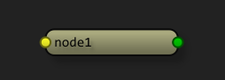
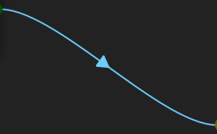

UI Modules
==========

The UI modules represent the user iterface side of the application. All widgets and handlers for the UI are stored here.

.. automodule:: ui.commands

ui.commands
-----------

.. _SceneNodesCommand:

SceneNodesCommand
^^^^^^^^^^^^^^^^^
The SceneNodesCommand is a command to send a node/scene data state to the Undo stack.

.. autoclass:: SceneNodesCommand
    :members:
    :special-members:
    :private-members:

.. _SceneChangedCommand:

SceneChangedCommand
^^^^^^^^^^^^^^^^^^^
The SceneChangedCommand is a command to send a node/scene data state to the Undo stack.

.. autoclass:: SceneChangedCommand
    :members:
    :special-members:
    :private-members:

.. automodule:: ui.graphics

ui.graphics
-----------

.. _GraphException:

GraphException
^^^^^^^^^^^^^^
Custom exception class.

.. autoclass:: GraphException
    :members:

.. _GraphicsView:

GraphicsView
^^^^^^^^^^^^
Custom QGraphicsView for use with SceneGraph.

.. autoclass:: GraphicsView
    :members:

.. _GraphicsScene:

GraphicsScene
^^^^^^^^^^^^^
Custom QGraphicsScene for use with SceneGraph. You can query any node widget via the GraphicsScene object:
::

 #!/usr/bin/env python
 node = ui.scene.get_node('default1')

 # query the node connections
 node.connections.keys()

 # get the output connection of node
 conn = node.getConnection('output')

.. autoclass:: GraphicsScene
    :members:

.. automodule:: ui.handlers

ui.handlers
-----------

.. _SceneEventHandler:

SceneEventHandler
^^^^^^^^^^^^^^^^^
The SceneEventHandler connects the Graph object to the :ref:`GraphicsScene` instance. Data is shuttled via callbacks back and forth.

.. autoclass:: SceneEventHandler
    :members:

.. automodule:: ui.settings

ui.settings
-----------

.. _Settings:

Settings
^^^^^^^^
The Settings is a custom QSettings object for managing SceneGraph user preferences.

.. autoclass:: Settings
    :members:

ui.stylesheet
-------------
.. _StylesheetManager:

StylesheetManager
^^^^^^^^^^^^^^^^^
The StylesheetManager parses stylesheets and font/color preferences.

.. automodule:: ui.stylesheet
.. autoclass:: StylesheetManager
    :members:

.. automodule:: ui.node_widgets

.. _node_widgets:

ui.node_widgets
---------------
The **node_widgets** module contains all of the node widgets used for drawing nodes in the graph. The current types are:

- :ref:`NodeWidget`
- :ref:`EdgeWidget`
- :ref:`Connection`

.. _NodeWidget:

NodeWidget
^^^^^^^^^^

The NodeWidget is the base class for all node widgets. NodeWidgets are custom :ref:`QtGui.QGraphicsObject` that contain a reference to their referenced `DagNode`. The NodeWidget *must* be instantiated with the DagNode as the first argument:

::

    g = core.Graph()
    dag = g.add_node('default')
    widget = NodeWidget(dag)

The NodeWidget reads its base attributes from the DagNode, and conversely, updates are passed back to the DagNode.

.. autoclass:: NodeWidget
    :members:

NodeLabel
^^^^^^^^^
The NodeLabel draws the node name.

.. autoclass:: NodeLabel
    :members:

.. _NodeBackground:

NodeBackground
^^^^^^^^^^^^^^
The :ref:`NodeBackground` draws the node background.

.. autoclass:: NodeBackground
    :members:

.. _EdgeWidget:

EdgeWidget
^^^^^^^^^^
The EdgeWidget is the base class for edge widgets:

.. autoclass:: EdgeWidget
    :members:

.. _Connection:

Connection
^^^^^^^^^^
The Connection defines connections between nodes.

.. autoclass:: Connection
    :members: