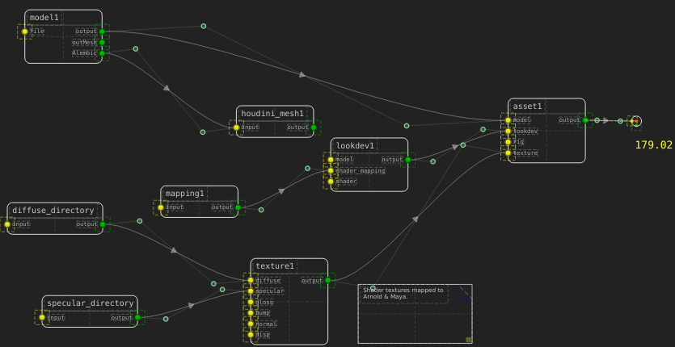
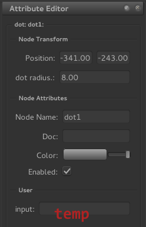

====================
Extending SceneGraph
====================

Extending SceneGraph is very easy. Custom plugins are easy to write and behave well with the builtin node types. The SceneGraph API provides four distinct classes of node:

- Execute
- Read
- Write
- Mapping

Writing your own plugins
========================

To write your own plugins, you'll need three things:

- DagNode object file
- NodeWidget object file
- Metadata attribute description file (optional)

You'll need to subclass the default :ref:`DagNode` object type, as well as a corresponding :ref:`NodeWidget` type.

Plugin Files
------------

Place your custom plugin somewhere in the SCENEGRAPH_PLUGIN_PATH_. You'll need to subclass the core :ref:`DagNode` class, and add your functionality on top of that. Let's start with a simple node:

::

    #!/usr/bin/env python
    from SceneGraph import options
    from SceneGraph.core.nodes import DagNode

    SCENEGRAPH_NODE_TYPE = 'myNode'

    class MyNode(DagNode):

        default_name  = 'my_node'
        default_color = [172, 172, 172, 255]
        node_type     = 'myNode'

        def __init__(self, name=None, **kwargs):
            super(MyNode, self).__init__(name, **kwargs)

After that, let's create a widget plugin:

::

    #!/usr/bin/env python
    from SceneGraph.ui import NodeWidget

    SCENEGRAPH_WIDGET_TYPE = 'myNode'

    class MyNodeWidget(NodeWidget):
        node_class     = 'dagnode' 
        def __init__(self, dagnode, parent=None):
            super(MyNodeWidget, self).__init__(dagnode, parent)

You'll need to define the global **SCENEGRAPH_NODE_TYPE** in the plugin file, and **SCENEGRAPH_WIDGET_TYPE** in the corresponding widget plugin. If they don't match, your plugin won't load.

Metadata Description Files
--------------------------
The metadata is used to describe your node's parameters to the application. You'll need to define attributes and groups. Private attributes will not show in the UI by default. Each node will inherit all of its parent classes metadata descriptors, so you won't have to manage parent attributes unless you choose to.

::

    # dot node attributes
    [group Node Transform]

        [attr width]
            default             FLOAT     8.0
            required            BOOL      true
            private             BOOL      true   

        [attr radius]
            default             FLOAT    8.0
            label               STRING   "dot radius"
            required            BOOL     true

The above metadata is the builtin **Dot** node's description. Rendered in the **AttributeEditor**, it looks like this:

Under the **Node Transform** group, we see the **Position** attribute. That attribute is inherited from the parent :ref:`DagNode` object. If we add it to the descriptor above and set the **private** paremeter, it will no longer render in the **AttributeEditor**:

::

    # dot node attributes
    [group Node Transform]

        [attr pos]
            private             BOOL      true

        [attr width]
            default             FLOAT     8.0
            required            BOOL      true
            private             BOOL      true   

        [attr radius]
            default             FLOAT    8.0
            label               STRING   "dot radius"
            required            BOOL     true

The **group** determines which group the attributes will be grouped under. Note that the **width** attribute is not shown, while the **radius** is. Setting the **width.private** paramenter to **false** will allow the user to change it. 

Warning: exposing private :ref:`DagNode` attributes can lead to system unstability. It is strongly recommended that you do not do that.

Building Plugins
----------------

After your plugin is ready, run the utility **/bin/build_plugin** on your files to create the plugin file.

Environment Setup
=================

To extend SceneGraph, there are a few environment variables we'll need to set:

.. _SCENEGRAPH_PLUGIN_PATH:

SCENEGRAPH_PLUGIN_PATH
----------------------

  - Use this variable to extend where SceneGraph goes to look for node plugins.

SCENEGRAPH_CONFIG_PATH
----------------------

  - Use this variable to add different font and color schemes for the UI.

SCENEGRAPH_STYLESHEET_PATH
--------------------------

  - Use this variable to add different Qt stylesheets for skinning the UI.