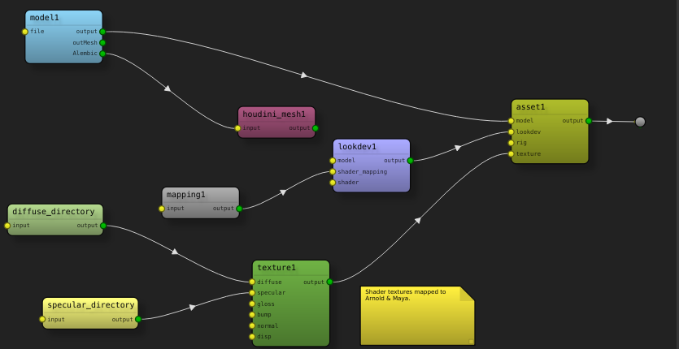

.. SceneGraph documentation master file, created by
   sphinx-quickstart on Wed Aug  5 08:13:03 2015.
   You can adapt this file completely to your liking, but it should at least
   contain the root `toctree` directive.

..  Header1
    =======

    Header2
    -------

    Header3
    ^^^^^^^

    Header4
    ~~~~~~~

SceneGraph v |version| documentation
==================================

**SceneGraph** is a fast & flexible framework for defining node graphs using PySide. Scenes can be saved and loaded in a variety of applications, and users can easily add their own nodes to suit their needs.

Supported Systems
-----------------
**SceneGraph** works on Linux, OSX* and Windows platforms. It currently supports the following DCC platforms:

- Maya 2015 & 2016
- Nuke 8 & 9
- Houdini 14 & 15

Applications that only support Python 2.6 are not supported.

\* OSX note: PySide performance on OSX 10.10 may experience slowdowns compared to Linux or Windows. OSX 10.11 is **highly** recommended.

Requirements
------------
    
- Python 2.7
- `NetworkX 1.9.1`_  
- `simplejson 3.7.2`_
- PySide 1.2

.. _NetworkX 1.9.1: https://github.com/networkx/networkx
.. _simplejson 3.7.2: https://github.com/simplejson/simplejson 

Contents
--------
.. toctree::
    :maxdepth: 3

    overview
    tutorial
    api
    extending

Indices and tables
==================

* :ref:`genindex`
* :ref:`modindex`
* :ref:`search`

