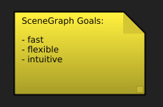

========
Overview
========

History
=======

SceneGraph was built to fascilitate a graphical interface for custom visual effects pipeline tools.

Goals
=====

SceneGraph is intended to provide a lightweight framework for visual node graphs. The goals currently are:

- fast: using PySide vector graphics allows nodes to be drawn quickly
- flexible: users can easily add their own nodes and functions
- intuitive: node widgets are easy to read and understand

