========
Tutorial
========

Getting started
===============

To start using SceneGraph, simply run **/bin/SceneGraph** from a shell. (Windows users run **/bin/SceneGraph.bat**)

On Linux and OSX, you can specify a file to open on launch:

::
    
    SceneGraph ~/graphs/my_graph_v001.json

Command-line flags
------------------

::

    # use OpenGL renderer
    -g

    # set Qt style
    -s @STYLE

DCC Applications
----------------

SceneGraph contains modules for Maya, Nuke & Houdini.

Maya
^^^^
::

    from SceneGraph import scenegraph_maya
    scenegraph_maya.main()

Nuke
^^^^
::

    from SceneGraph import scenegraph_nuke
    scenegraph_nuke.main()

Houdini
^^^^^^^

Coming soon.

Other Applications
^^^^^^^^^^^^^^^^^^
To use SceneGraph in another application, simply import the UI from the standard module: 
::

    from SceneGraph import scenegraph
    sgui = scenegraph.SceneGraphUI()
    sgui.show()

Node Types
==========

Default
-------

Merge
-----

Note
-----

Dot
---

Working with the Graph
======================

You can delete nodes with the delete key, split nodes by clicking on the midpoint arrow in an edge. Additionally, if you select nodes(s) and drag with the option key pressed, upstream nodes will also be selected and moved.

Creating Nodes
--------------

There are several ways to create a node in the graph:

- right-click the mouse in the graph area to open the **Add node** menu.
- press the **tab button** to open the **Add node** menu.
- choose a node type from the **Nodes>Add node** menu.

Choose a node type and it will be placed near where your mouse is positioned.

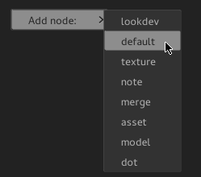

Connecting Nodes
----------------

To connect two nodes, click on a green output terminal of one node, and drag the mouse to the yellow input terminal of another node.

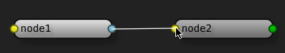

Expanding & Folding Nodes
-------------------------

If you select a node in the :ref:`attr_editor`, you'll see an **Expand Node** checkbox:

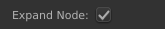

Expanding a node shows all of its connections in the graph, un-expanding it makes it as small as possible:

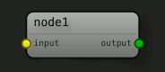

Viewing Dependencies
--------------------

Selected nodes' dependencies are visible in the **Dependencies** pane.

Saving & Loading Scenes
=======================

Saving and loading is managed through the **File** menu. If the user attempts to close the application when a file has not been saved, they will be prompted to close the appliation without saving.

Autosaving
----------
**SceneGraph** autosaves after a predetermined amount of time. If the user attempts to open a scene that has a newer autosave, they will be prompted to choose opening either the original, or the autosave file (useful in the event of a crash).

.. _attr_editor:

Attribute Editor
================

The :ref:`attr_editor` is a powerful tool to interface with nodes in the graph.

Adding Attributes
-----------------

To add an attribute to a node, select it and right-click in the **AttributeEditor** pane. Choose **Add Attribute** which will open a dialog:

.. image:: ../images/add_attribute_dialog.png

Choose a name and type, and click okay to add it. By default it will appear in the **User** group in the **AttributeEditor**. You can also choose to make the attribute connectable, in which case it will show up as a terminal in the graph (user attributes will render with an italicized label).

Keyboard Commands
=================

+------------+------------+-----------+-------------------------------+
| Key        | Modifier   | Modifier  | Description                   |
+============+============+===========+===============================+ 
| A          |            |           | fit all nodes in the graph    |
+------------+------------+-----------+-------------------------------+
| D          |            |           | disable selected nodes        |
+------------+------------+-----------+-------------------------------+
| E          |            |           | toggle edge types             |
+------------+------------+-----------+-------------------------------+
| F          |            |           | fit selected nodes in graph   |
+------------+------------+-----------+-------------------------------+
| Tab        |            |           | open the **Add node** menu    |
+------------+------------+-----------+-------------------------------+
| Option     |            |           | split edge with a dot node*   |
+------------+------------+-----------+-------------------------------+
| Option     |            |           | select upstream nodes**       |
+------------+------------+-----------+-------------------------------+
| O          | Ctrl       |           | open a scene from disk        |
+------------+------------+-----------+-------------------------------+
| S          | Ctrl       |           | save the current scene        |
+------------+------------+-----------+-------------------------------+
| Z          | Ctrl       |           | undo the last action          |
+------------+------------+-----------+-------------------------------+
| Z          | Ctrl       | Shift     | redo the last action          |
+------------+------------+-----------+-------------------------------+

\* mouse must be hovering over the middle of an edge.

\*\* if pressed while dragging a node, upstream nodes will be selected as well.

Plugins
=======

Node types are loaded as plugins. New plugins can be added via the :ref:`SCENEGRAPH_PLUGIN_PATH`. variable.

Enabling/disabling plugins
--------------------------

To open the :ref:`PluginManager`, select the **Windows>Plugins...** menu.

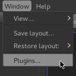

The **PluginManager** interface allows the user to enable, disable or load new plugins. The current plugin configuration will be saved to the user's preferences, so on the next launch, **SceneGraph** will only load the current plugins.

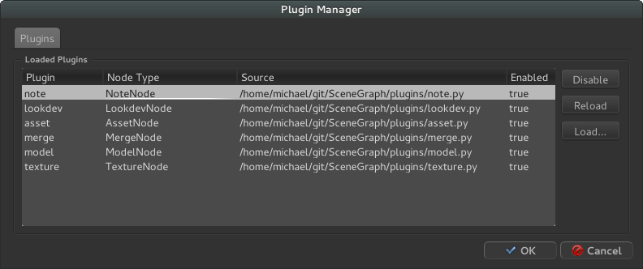

Preferences
===========

**SceneGraph** includes a robust preferences system. Users can save and load UI layouts, as well as customize the graph drawing style to suit their preference.

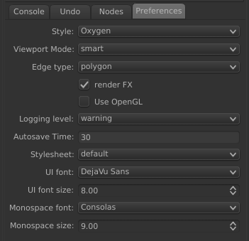

Viewport Mode
-------------

Changing the drawing style can increase draw performance. Options are **full**, **smart** and **minimal**. **Full** will look best, while **minimal** will draw faster, but might briefly display some artifacts when updating the scene. **Smart** is the default.

Edge Types
----------

Edges can be rendered as **bezier** or **polygon**. Use polygon mode to increase draw performance.

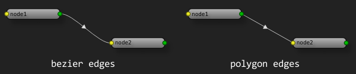

Render FX
---------
Unchecking this will turn off FX like dropshadows and glows on nodes, labels and edges. Can be used to increase draw performance.

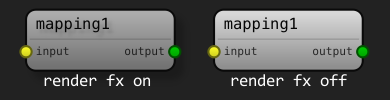

OpenGL
------

Enable the **OpenGL** option to use OpenGL to render the node graph. 

Autosave
--------

In the **Preferences** pane, users can edit the autosave increment (measured in seconds):

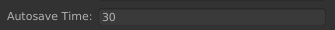

Autosave files are saved alongside the working files, or the **TMPDIR** directory if the file has not yet been saved.

Stylesheets
-----------

This menu displays all of the currently loaded stylesheets, and allows the user to update the style on the fly.

Layouts
-------

You can save and load UI layouts in the **Windows** menu. To save a layout, select the **Windows>Save layout** menu option and input a name into the dialog:

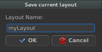

Restore a layout from the **Windows>Restore layout** menu:

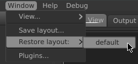

